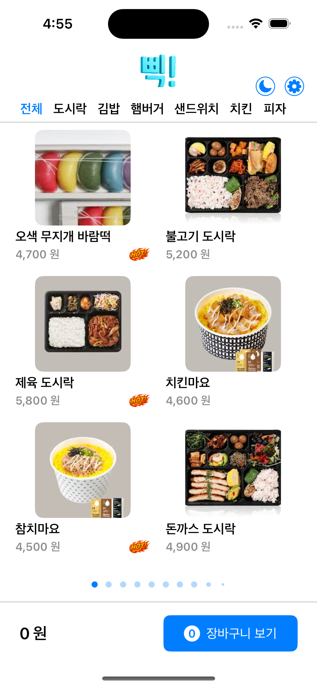

# 키오스크 쇼핑 앱
## 프로젝트 개요
이 프로젝트는 간단한 키오스크 스타일의 iOS 쇼핑 애플리케이션입니다. 사용자는 카테고리별로 상품을 탐색하고, 장바구니에 추가하며, 담긴 상품을 확인할 수 있습니다. 이 앱은 Swift를 사용하여 현대적인 코드 기반 UI(Programmatic UI)로 설계되었으며, 비동기 데이터 처리 및 이미지 로딩 기능을 갖추고 있습니다.

## 스크린샷



## 주요 기능
* **상품 탐색**: 페이지 형식의 컬렉션 뷰를 통해 상품을 보여줍니다.
* **카테고리 필터링**: 사용자는 카테고리를 선택하여 상품을 필터링할 수 있습니다. ‘전체’ 카테고리는 모든 상품을 통합하여 보여줍니다.
* **장바구니**:
    * 상품 목록에서 장바구니로 바로 상품을 추가할 수 있습니다.
    * 장바구니에 담긴 모든 상품을 확인할 수 있습니다.
    * 장바구니 내 각 상품의 수량을 조절할 수 있습니다.
    * 장바구니에서 상품을 삭제할 수 있습니다.
    * 장바구니의 총 수량과 금액이 실시간으로 업데이트됩니다.
* **비동기 이미지 로딩**: 상품 이미지는 URL로부터 비동기적으로 가져오며, 캐싱을 지원하여 성능을 향상시킵니다. 이미지를 다운로드하는 동안에는 로딩 인디케이터가 표시됩니다.
* **다크 모드 지원**: 사용자 인터페이스는 시스템의 라이트/다크 모드 설정에 자동으로 적응합니다.
* **지역화 (Localization)**: 앱은 다국어를 지원하도록 구성되어 있으며, 선택된 언어에 따라 다른 데이터를 로드합니다. 언어 변경을 위해 시스템 설정으로 이동하는 버튼이 제공됩니다.
* **코드 기반 UI (Programmatic UI)**: 모든 사용자 인터페이스는 스토리보드 없이 `SnapKit`과 `Then` 라이브러리를 사용하여 코드로 작성되었습니다.
* **Compositional Layout을 활용한 모던 UI**: 메인 상품 뷰는 복잡하고 페이지화된 그리드 레이아웃을 위해 `UICollectionView`와 `UICollectionViewCompositionalLayout`을 사용합니다.
* **효율적인 데이터 처리**: 데이터 변경 시 컬렉션 뷰를 효율적으로 업데이트하기 위해 `UICollectionViewDiffableDataSource`를 사용합니다.
## 아키텍처
이 애플리케이션은 주로 **Model-View-Controller (MVC)** 디자인 패턴을 따릅니다.
* **Model**: `CategoryData`, `MenuData`, `CartItemData`와 같이 애플리케이션의 데이터를 나타내는 데이터 구조입니다.
* **View**: `ShopView`, `CartView`, `ShopCell`, `CartItemCell` 과 같이 UI 구성 요소를 정의한 파일입니다. 데이터 표시와 사용자 입력을 담당합니다.
* **Controller**: `ViewController`와 `CartViewController`는 Model과 View 사이의 다리 역할을 합니다. 사용자 상호작용을 처리하고, 데이터를 가져오며, UI를 업데이트합니다.
`CartManager`에는 싱글톤(Singleton) 패턴이 적용되어, 장바구니 상태 관리를 위한 단일 접근점을 전역적으로 제공합니다. 또한 `NotificationCenter`를 사용하여 장바구니 업데이트를 앱의 여러 부분에 전달함으로써 UI가 항상 동기화된 상태를 유지하도록 합니다.

## 파일구조
```
.
├── Bbik
│   ├── Application
│   │   ├── AppDelegate.swift
│   │   ├── Base.lproj
│   │   │   └── LaunchScreen.storyboard
│   │   ├── Info.plist
│   │   ├── ko.lproj
│   │   │   └── LaunchScreen.strings
│   │   └── SceneDelegate.swift
│   ├── Resource
│   │   ├── Assets.xcasset
│   │   ├── endata.json
│   │   ├── krdata.json
│   │   └── Localizable.xcstrings
│   └── Source
│       ├── Component
│       │   └── QuantityControl.swift
│       ├── Extensions
│       │   └── Int++.swift
│       ├── Model
│       │   ├── CartModel.swift
│       │   └── ShopModel.swift
│       ├── Service
│       │   ├── CartManager.swift
│       │   ├── ImageFetcher.swift
│       │   └── ShopDataService.swift
│       ├── View
│       │   ├── CartItemCell.swift
│       │   ├── CartView.swift
│       │   ├── ShopCell.swift
│       │   └── ShopView.swift
│       └── ViewController
│           ├── CartViewController.swift
│           └── ViewController.swift
└── Bbik.xcodeproj
```
## 핵심 구성 요소 및 로직

### 1. 메인 상점 (`ViewController` & `ShopView`)

* **데이터 로딩**: `ShopDataService`는 로컬 JSON 파일에서 상품 정보를 읽어옵니다. `ViewController`는 뷰가 로드될 때 이 서비스를 호출하여 데이터를 가져옵니다.
* **UI 구성**: `ShopView`는 레이아웃과 설정을 위해 `SnapKit`과 `Then`을 사용합니다. 메인 상품 표시는 `UICollectionView`로 구현되어 있습니다.
* **Compositional Layout**: `UICollectionViewCompositionalLayout`은 페이지당 2x3 그리드로 아이템을 정렬하기 위해 사용됩니다. 이 레이아웃은 수평 "그룹 페이징" 스크롤을 지원하여 스와이프로 페이지를 넘기는 경험을 제공합니다.
* **Diffable Data Source**: `UICollectionViewDiffableDataSource`는 상품 데이터를 컬렉션 뷰에 연결합니다. 이를 통해 사용자가 다른 카테고리를 선택했을 때 효율적이고 애니메이션이 적용된 업데이트가 가능합니다.
* **카테고리 필터링**: 각 카테고리 버튼은 동적으로 생성됩니다. 버튼을 탭하면 `selectedMenu` 상태가 업데이트되고, 데이터가 필터링되며, diffable data source에 새로운 스냅샷이 적용되어 UI가 업데이트됩니다.

### 2. 장바구니 (`CartManager`, `CartViewController`)

* **상태 관리**: `CartManager`는 `CartItemData` 배열을 관리하는 싱글톤 클래스입니다. 아이템 추가, 수량 변경, 장바구니 비우기 등의 메서드를 제공합니다.
* **알림 (Notifications)**: 장바구니가 수정될 때마다 `CartManager`는 `.cartUpdated` 알림을 보냅니다. `ViewController`와 `CartViewController`는 이 알림을 관찰하여 각자의 뷰를 새로고침합니다.
* **장바구니 표시**: `CartViewController`는 `UITableView`를 사용하여 장바구니에 담긴 상품들을 표시합니다. 각 행에는 상품 상세 정보와 수량 조절 컨트롤(`QuantityControl`)이 포함된 `CartItemCell`이 사용됩니다.
* **수량 조절**: 사용자는 `CartItemCell` 내에서 직접 상품의 수량을 변경할 수 있습니다. 이 동작은 `CartManager`를 호출하여 데이터를 업데이트하고, 결과적으로 알림을 통해 UI 업데이트를 유발합니다.

### 3. 비동기 작업 (`ImageFetcher.swift`)

* **Async/Await**: `fetchImageAsync` 함수는 Swift의 모던 동시성 기능인 `async/await`를 사용하여 메인 스레드를 차단하지 않고 URL에서 이미지 데이터를 다운로드합니다.
* **이미지 캐싱**: 전역 `NSCache` 인스턴스를 사용하여 다운로드한 이미지를 저장합니다. 다운로드를 시도하기 전에 이미지가 캐시에 있는지 확인하여 네트워크 사용량을 줄이고 성능을 향상시킵니다.
* **에러 처리**: 이 함수는 `ImageDownloadError`라는 특정 에러 타입을 정의하고, `do-catch` 블록을 사용하여 유효하지 않은 URL, 네트워크 오류, 잘못된 이미지 데이터와 같은 잠재적 문제를 처리합니다. 에러 발생 시 UI에는 플레이스홀더 이미지가 표시됩니다.
